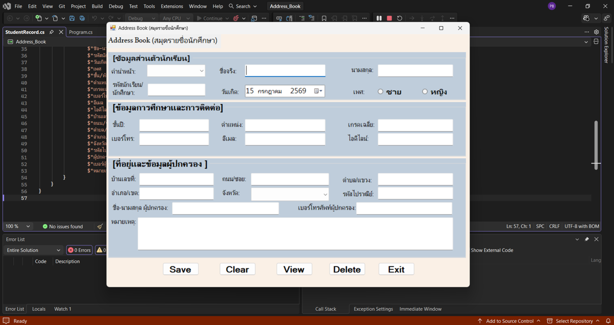
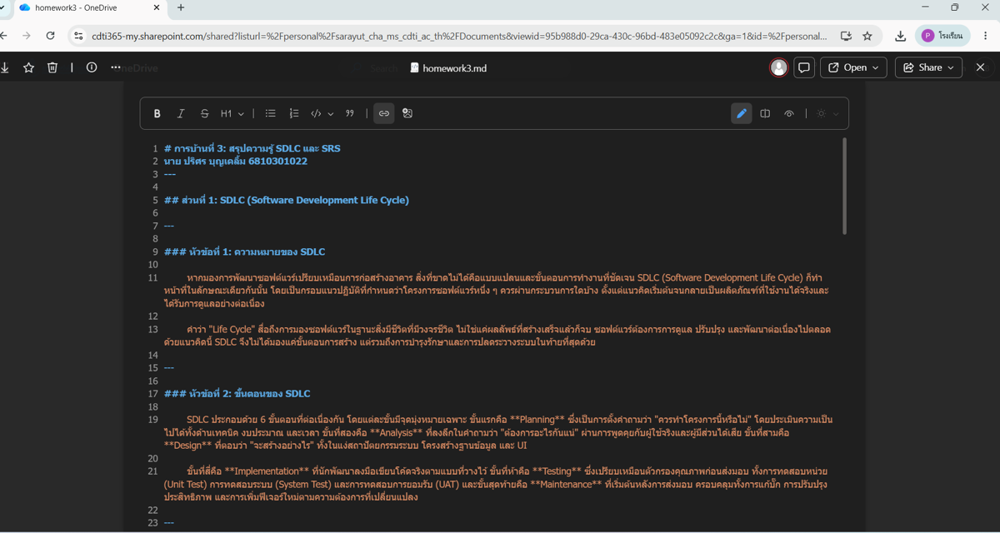
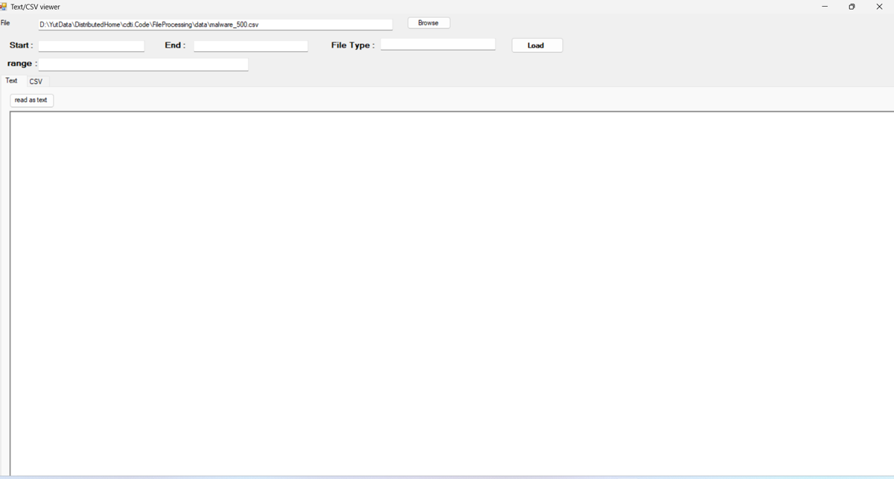
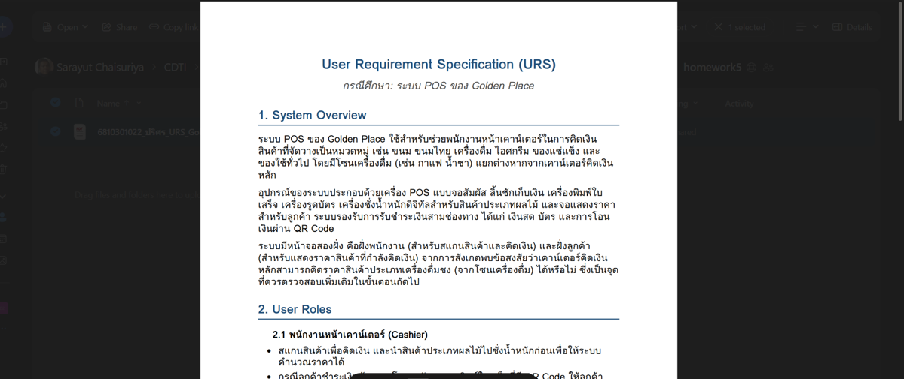
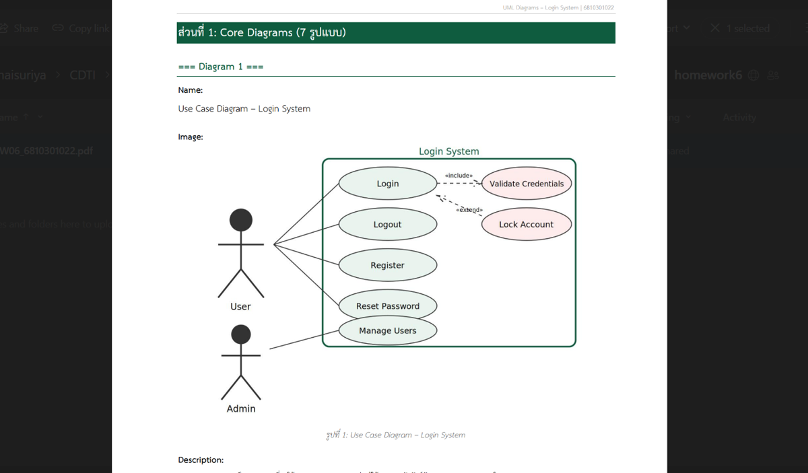
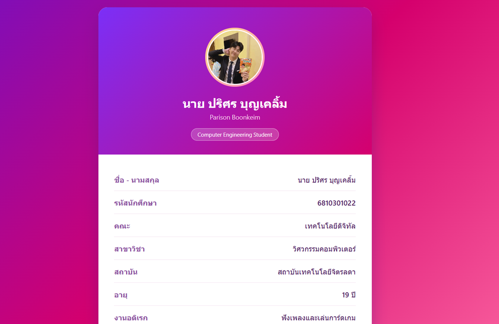

=== Student Info ===
Name: นายปริศร บุญเคลิ้ม (โช)
Student ID: 6810301022

=== Website Info ===
URL: https://parisonboomkein.github.io/HW08--HTML-CSS-cloud/
Number of Pages: 11
Menu Structure: Home | About | CV | Portfolio | Contact

=== Pages Detail ===

--- Page ---
File Name: index.html
Description: หน้าแรก แนะนำตัว พร้อมเมนูนำทางและภาพรวมเว็บไซต์
Code:
```html
<!DOCTYPE html>
<html lang="th">
<head>
<meta charset="UTF-8">
<meta name="viewport" content="width=device-width, initial-scale=1.0">
<title>หน้าแรก | เว็บไซต์ส่วนตัว</title>
<link rel="stylesheet" href="css/style.css">
</head>
<body>

<header class="site-header">
  <div class="nav-wrap">
    <a href="index.html" class="brand">ปริศร<span>บุญเคลิ้ม</span></a>
    <button class="nav-toggle" aria-label="เปิดเมนู">เมนู</button>
    <ul class="nav-list">
      <li><a href="index.html" class="active">Home</a></li>
      <li><a href="about.html">About</a></li>
      <li><a href="cv.html">CV</a></li>
      <li><a href="portfolio.html">Portfolio</a></li>
      <li><a href="contact.html">Contact</a></li>
    </ul>
  </div>
</header>

<section class="hero">
  <div>
    <span class="eyebrow">Personal Homepage</span>
    <h1>สวัสดีครับ ผม<br>ปริศร บุญเคลิ้ม (โช)</h1>
    <p class="lead">
      นักศึกษาชั้นปีที่ 2 สาขาวิศวกรรมคอมพิวเตอร์ คณะเทคโนโลยีดิจิทัล
      สถาบันเทคโนโลยีจิตรลดา ชอบเรียนรู้สิ่งใหม่ ๆ อยู่เสมอ
      เว็บไซต์นี้รวบรวมผลงานการบ้าน ประวัติย่อ
      และช่องทางติดต่อไว้ในที่เดียว
    </p>
    <div class="hero-actions">
      <a href="portfolio.html" class="btn btn-primary">ดูผลงานการบ้าน</a>
      <a href="cv.html" class="btn btn-outline">ดู CV / Resume</a>
    </div>
  </div>
  
</section>

<main>
  <h2>สิ่งที่คุณจะพบในเว็บไซต์นี้</h2>
  <div class="card-grid">
    <div class="info-card">
      <h3>About</h3>
      <p>เรื่องราวเกี่ยวกับตัวผม ความสนใจ และเป้าหมายในการเรียน</p>
      <a href="about.html">ไปที่หน้า About →</a>
    </div>
    <div class="info-card">
      <h3>CV / Resume</h3>
      <p>ประวัติการศึกษา ทักษะ และประสบการณ์ของผม</p>
      <a href="cv.html">ไปที่หน้า CV →</a>
    </div>
    <div class="info-card">
      <h3>Portfolio</h3>
      <p>รวมรายการการบ้านทั้งหมดของวิชานี้ พร้อมลิงก์ดูและดาวน์โหลด</p>
      <a href="portfolio.html">ไปที่หน้า Portfolio →</a>
    </div>
    <div class="info-card">
      <h3>Contact</h3>
      <p>แบบฟอร์มสำหรับส่งข้อความหรือติดต่อผมโดยตรง</p>
      <a href="contact.html">ไปที่หน้า Contact →</a>
    </div>
  </div>
</main>

<footer class="site-footer">
  6810301022 · เว็บไซต์นี้พัฒนาด้วย HTML5 + CSS3
</footer>

<script src="js/main.js"></script>
</body>
</html>
```

--- Page ---
File Name: about.html
Description: หน้าเกี่ยวกับตัวผม เล่าความสนใจและกิจกรรมนอกเวลาเรียน
Code:
```html
<!DOCTYPE html>
<html lang="th">
<head>
<meta charset="UTF-8">
<meta name="viewport" content="width=device-width, initial-scale=1.0">
<title>About | เว็บไซต์ส่วนตัว</title>
<link rel="stylesheet" href="css/style.css">
</head>
<body>

<header class="site-header">
  <div class="nav-wrap">
    <a href="index.html" class="brand">ปริศร<span>บุญเคลิ้ม</span></a>
    <button class="nav-toggle" aria-label="เปิดเมนู">เมนู</button>
    <ul class="nav-list">
      <li><a href="index.html">Home</a></li>
      <li><a href="about.html" class="active">About</a></li>
      <li><a href="cv.html">CV</a></li>
      <li><a href="portfolio.html">Portfolio</a></li>
      <li><a href="contact.html">Contact</a></li>
    </ul>
  </div>
</header>

<main>
  <span class="eyebrow">About</span>
  <h1>รู้จักผมมากขึ้น</h1>

  

  <p>
    ผมชื่อ ปริศร บุญเคลิ้ม (โช) เป็นนักศึกษาชั้นปีที่ 2 สาขาวิศวกรรมคอมพิวเตอร์
    คณะเทคโนโลยีดิจิทัล สถาบันเทคโนโลยีจิตรลดา ตอนนี้ยังไม่มีสิ่งที่สนใจเป็นพิเศษ
    สายใดสายหนึ่งชัดเจน แต่เป็นคนชอบลองสิ่งใหม่ ๆ อยู่เสมอ
  </p>

  <p>
    นอกเวลาเรียน ผมชอบศึกษาสิ่งต่าง ๆ เพื่อค้นหาตัวเอง เช่น เรียนเขียนโค้ด
    ร้องเพลง เล่นเกม และการ์ดเกม
  </p>

  <h2>ความสนใจ</h2>
  <div class="tags">
    <span class="tag">Coding</span>
    <span class="tag">Music</span>
    <span class="tag">Gaming</span>
    <span class="tag">Card Games</span>
  </div>

  <div class="hero-actions" style="margin-top:32px;">
    <a href="portfolio.html" class="btn btn-primary">ดูผลงานของผม</a>
    <a href="contact.html" class="btn btn-outline">ติดต่อผม</a>
  </div>
</main>

<footer class="site-footer">
  6810301022 · เว็บไซต์นี้พัฒนาด้วย HTML5 + CSS3
</footer>

<script src="js/main.js"></script>
</body>
</html>
```

--- Page ---
File Name: cv.html
Description: หน้า CV/Resume แสดงประวัติการศึกษา ทักษะ และประสบการณ์
Code:
```html
<!DOCTYPE html>
<html lang="th">
<head>
<meta charset="UTF-8">
<meta name="viewport" content="width=device-width, initial-scale=1.0">
<title>CV / Resume | เว็บไซต์ส่วนตัว</title>
<link rel="stylesheet" href="css/style.css">
</head>
<body>

<header class="site-header">
  <div class="nav-wrap">
    <a href="index.html" class="brand">ปริศร<span>บุญเคลิ้ม</span></a>
    <button class="nav-toggle" aria-label="เปิดเมนู">เมนู</button>
    <ul class="nav-list">
      <li><a href="index.html">Home</a></li>
      <li><a href="about.html">About</a></li>
      <li><a href="cv.html" class="active">CV</a></li>
      <li><a href="portfolio.html">Portfolio</a></li>
      <li><a href="contact.html">Contact</a></li>
    </ul>
  </div>
</header>

<main>
  <span class="eyebrow">CV / Resume</span>
  <h1>นายปริศร บุญเคลิ้ม (โช)</h1>
  <p class="lead">Student ID: 6810301022 &nbsp;|&nbsp; อีเมล: 6810301022@cdti.ac.th</p>

  <h2>การศึกษา</h2>
  <div class="cv-item">
    <div class="cv-period">2024 – ปัจจุบัน</div>
    <div>
      <h3>ปริญญาตรี สาขาวิศวกรรมคอมพิวเตอร์</h3>
      <div class="cv-sub">คณะเทคโนโลยีดิจิทัล สถาบันเทคโนโลยีจิตรลดา — ชั้นปีที่ 2</div>
    </div>
  </div>
  <div class="cv-item">
    <div class="cv-period">2021 – 2024</div>
    <div>
      <h3>มัธยมศึกษาตอนปลาย สายวิทย์-คณิต</h3>
      <div class="cv-sub">โรงเรียนอุทัยวิทยาคม</div>
    </div>
  </div>

  <h2>ทักษะ (Skills)</h2>
  <div class="tags">
    <span class="tag">Python</span>
    <span class="tag">C++</span>
    <span class="tag">Git / GitHub</span>
    <span class="tag">Database</span>
    <span class="tag">HTML / CSS</span>
  </div>

  <h2>ประสบการณ์</h2>
  <div class="cv-item">
    <div class="cv-period">2568</div>
    <div>
      <h3>เกมกระดานแบบอิเล็กทรอนิกส์</h3>
      <div class="cv-sub">ออกแบบและเขียนโค้ดด้วยภาษา C++ พัฒนาเกมกระดานให้ทำงานร่วมกับวงจรอิเล็กทรอนิกส์ ฝึกทักษะการเขียนโปรแกรมควบคู่กับฮาร์ดแวร์</div>
    </div>
  </div>

  <h2>ช่องทางติดต่อ</h2>
  <p>
    อีเมล: 6810301022@cdti.ac.th<br>
    GitHub: github.com/ParisonBoomkein<br>
    โทรศัพท์: 063-443-0981
  </p>
</main>

<footer class="site-footer">
  6810301022 · เว็บไซต์นี้พัฒนาด้วย HTML5 + CSS3
</footer>

<script src="js/main.js"></script>
</body>
</html>
```

--- Page ---
File Name: portfolio.html
Description: หน้าแสดงผลงานการบ้าน HW02-HW07 พร้อมปุ่มดูรายละเอียดและดาวน์โหลด
Code:
```html
<!DOCTYPE html>
<html lang="th">
<head>
<meta charset="UTF-8">
<meta name="viewport" content="width=device-width, initial-scale=1.0">
<title>Portfolio | เว็บไซต์ส่วนตัว</title>
<link rel="stylesheet" href="css/style.css">
</head>
<body>

<header class="site-header">
  <div class="nav-wrap">
    <a href="index.html" class="brand">ปริศร<span>บุญเคลิ้ม</span></a>
    <button class="nav-toggle" aria-label="เปิดเมนู">เมนู</button>
    <ul class="nav-list">
      <li><a href="index.html">Home</a></li>
      <li><a href="about.html">About</a></li>
      <li><a href="cv.html">CV</a></li>
      <li><a href="portfolio.html" class="active">Portfolio</a></li>
      <li><a href="contact.html">Contact</a></li>
    </ul>
  </div>
</header>

<main class="wide">
  <span class="eyebrow">Portfolio</span>
  <h1>ผลงานการบ้าน</h1>
  <p class="lead">
    รวมการบ้านทั้งหมดของรายวิชานี้ แต่ละรายการมีปุ่ม "ดู (View)" สำหรับเปิดหน้ารายละเอียด
    และปุ่ม "ดาวน์โหลด" สำหรับดาวน์โหลดไฟล์งาน — เพิ่มการบ้านใหม่ในอนาคตได้ง่าย
    เพียงคัดลอกโครงการ์ดแล้วแก้ข้อมูล
  </p>

  <div class="portfolio-grid">

    <div class="hw-card">
      
      <div class="hw-body">
        <h3>HW02: C# Windows Forms Application (Address Book)</h3>
        <p>ฝึกการออกแบบและพัฒนา Windows Forms Application ด้วยภาษา C# โดยเน้นการสร้าง GUI และการเขียนโปรแกรมแบบ Event-driven</p>
        <div class="hw-actions">
          <a class="btn btn-primary btn-small" href="hw-detail-02.html">ดู (View)</a>
          <a class="btn btn-outline btn-small" href="downloads/hw02.zip" download>ดาวน์โหลด</a>
        </div>
      </div>
    </div>

    <div class="hw-card">
      
      <div class="hw-body">
        <h3>HW03: การทบทวนความรู้ SDLC และ SRS</h3>
        <p>เข้าใจพื้นฐานของกระบวนการพัฒนาซอฟต์แวร์ (SDLC) และการจัดทำเอกสารข้อกำหนดซอฟต์แวร์ (SRS) รวมถึงสามารถสรุปความรู้ได้ด้วยตนเอง</p>
        <div class="hw-actions">
          <a class="btn btn-primary btn-small" href="hw-detail-03.html">ดู (View)</a>
          <a class="btn btn-outline btn-small" href="downloads/hw03.zip" download>ดาวน์โหลด</a>
        </div>
      </div>
    </div>

    <div class="hw-card">
      
      <div class="hw-body">
        <h3>HW04: FileProcessing + MalwareBazaar Dataset + Test Case</h3>
        <p>การจัดการข้อมูลขนาดใหญ่ (~1 ล้านรายการ), การเพิ่ม feature ตาม requirement และการทำ Software Testing (Test Case / Test Report)</p>
        <div class="hw-actions">
          <a class="btn btn-primary btn-small" href="hw-detail-04.html">ดู (View)</a>
          <a class="btn btn-outline btn-small" href="downloads/hw04.zip" download>ดาวน์โหลด</a>
        </div>
      </div>
    </div>

    <div class="hw-card">
      
      <div class="hw-body">
        <h3>HW05: User Requirement Specification (URS) ระบบ POS ของ Golden Place</h3>
        <p>ฝึกเขียน User Requirement Specification (URS) สำหรับระบบ POS จริง ครอบคลุม System Overview และ User Roles</p>
        <div class="hw-actions">
          <a class="btn btn-primary btn-small" href="hw-detail-05.html">ดู (View)</a>
          <a class="btn btn-outline btn-small" href="downloads/hw05.zip" download>ดาวน์โหลด</a>
        </div>
      </div>
    </div>

    <div class="hw-card">
      
      <div class="hw-body">
        <h3>HW06: UML Diagrams</h3>
        <p>เข้าใจ UML Diagram แต่ละประเภท สามารถค้นหาและตีความ diagram ได้ และฝึกอธิบาย diagram อย่างกระชับ</p>
        <div class="hw-actions">
          <a class="btn btn-primary btn-small" href="hw-detail-06.html">ดู (View)</a>
          <a class="btn btn-outline btn-small" href="downloads/hw06.zip" download>ดาวน์โหลด</a>
        </div>
      </div>
    </div>

    <div class="hw-card">
      
      <div class="hw-body">
        <h3>HW07: การตั้งค่า IIS และพัฒนาเว็บเบื้องต้น</h3>
        <p>เข้าใจการใช้งาน IIS (Internet Information Services) ฝึกการพัฒนาเว็บด้วย HTML, CSS และเรียนรู้การทำงานร่วมกันระหว่าง Client-side และ Server-side</p>
        <div class="hw-actions">
          <a class="btn btn-primary btn-small" href="hw-detail-07.html">ดู (View)</a>
          <a class="btn btn-outline btn-small" href="downloads/hw07.zip" download>ดาวน์โหลด</a>
        </div>
      </div>
    </div>

    <!-- เพิ่มการบ้านใหม่: คัดลอกบล็อก <div class="hw-card">...</div> ด้านบน 1 ชุด แล้วแก้ข้อมูล -->

  </div>
</main>

<footer class="site-footer">
  6810301022 · เว็บไซต์นี้พัฒนาด้วย HTML5 + CSS3
</footer>

<script src="js/main.js"></script>
</body>
</html>
```

--- Page ---
File Name: contact.html
Description: หน้าฟอร์มติดต่อ ส่งข้อความผ่านอีเมลได้จริง
Code:
```html
<!DOCTYPE html>
<html lang="th">
<head>
<meta charset="UTF-8">
<meta name="viewport" content="width=device-width, initial-scale=1.0">
<title>Contact | เว็บไซต์ส่วนตัว</title>
<link rel="stylesheet" href="css/style.css">
</head>
<body>

<header class="site-header">
  <div class="nav-wrap">
    <a href="index.html" class="brand">ปริศร<span>บุญเคลิ้ม</span></a>
    <button class="nav-toggle" aria-label="เปิดเมนู">เมนู</button>
    <ul class="nav-list">
      <li><a href="index.html">Home</a></li>
      <li><a href="about.html">About</a></li>
      <li><a href="cv.html">CV</a></li>
      <li><a href="portfolio.html">Portfolio</a></li>
      <li><a href="contact.html" class="active">Contact</a></li>
    </ul>
  </div>
</header>

<main>
  <span class="eyebrow">Contact</span>
  <h1>ส่งข้อความถึงผม</h1>
  <p class="lead">มีคำถามหรือต้องการติดต่อผม? กรอกแบบฟอร์มด้านล่างได้เลยครับ</p>

  <form class="contact-form" onsubmit="return sendViaMailto(event)">
    <div class="form-group">
      <label for="fullname">ชื่อ-นามสกุล</label>
      <input type="text" id="fullname" name="name" placeholder="กรอกชื่อของคุณ" required>
    </div>

    <div class="form-group">
      <label for="email">อีเมล</label>
      <input type="email" id="email" name="email" placeholder="you@example.com" required>
    </div>

    <div class="form-group">
      <label for="message">ข้อความ</label>
      <textarea id="message" name="message" placeholder="พิมพ์ข้อความของคุณที่นี่..." required></textarea>
    </div>

    <button type="submit" class="btn btn-primary">ส่งข้อความ</button>
    <p class="form-note">* กดแล้วโปรแกรมอีเมลของคุณจะเปิดขึ้นมาพร้อมข้อความนี้ ให้กด "ส่ง" อีกครั้งในโปรแกรมอีเมล</p>
  </form>
</main>

<footer class="site-footer">
  6810301022 · เว็บไซต์นี้พัฒนาด้วย HTML5 + CSS3
</footer>

<script src="js/main.js"></script>
</body>
</html>
```

--- Page ---
File Name: hw-detail-02.html
Description: รายละเอียดผลงาน HW02: C# Windows Forms Application (Address Book)
Code:
```html
<!DOCTYPE html>
<html lang="th">
<head>
<meta charset="UTF-8">
<meta name="viewport" content="width=device-width, initial-scale=1.0">
<title>HW02: C# Windows Forms Application (Address Book) | เว็บไซต์ส่วนตัว</title>
<link rel="stylesheet" href="css/style.css">
</head>
<body>

<header class="site-header">
  <div class="nav-wrap">
    <a href="index.html" class="brand">ปริศร<span>บุญเคลิ้ม</span></a>
    <button class="nav-toggle" aria-label="เปิดเมนู">เมนู</button>
    <ul class="nav-list">
      <li><a href="index.html">Home</a></li>
      <li><a href="about.html">About</a></li>
      <li><a href="cv.html">CV</a></li>
      <li><a href="portfolio.html" class="active">Portfolio</a></li>
      <li><a href="contact.html">Contact</a></li>
    </ul>
  </div>
</header>

<main>
  <span class="eyebrow">Portfolio / รายละเอียดการบ้าน</span>
  <h1>HW02: C# Windows Forms Application (Address Book)</h1>

  <div class="detail-meta">
    <span class="tag">C#</span>
  </div>

  

  <h2>รายละเอียด</h2>
  <p>พัฒนาโปรแกรมสมุดรายชื่อนักศึกษา (Address Book) ด้วย C# Windows Forms ประกอบด้วยฟอร์มกรอกข้อมูลส่วนตัว ข้อมูลการศึกษา และข้อมูลผู้ปกครอง พร้อมปุ่มจัดการข้อมูล Save, Clear, View และ Delete</p>

  <h2>สิ่งที่ได้เรียนรู้</h2>
  <p>ได้ฝึกออกแบบ GUI ด้วย Windows Forms การจัดวาง Layout ของฟอร์มให้ใช้งานง่าย และการเขียนโปรแกรมแบบ Event-driven สำหรับจัดการข้อมูลผ่านปุ่มต่าง ๆ</p>

  <div class="hero-actions">
    <a href="downloads/hw02.zip" class="btn btn-primary" download>ดาวน์โหลดไฟล์งาน</a>
    <a href="portfolio.html" class="btn btn-outline">← กลับไปหน้า Portfolio</a>
  </div>
</main>

<footer class="site-footer">
  6810301022 · เว็บไซต์นี้พัฒนาด้วย HTML5 + CSS3
</footer>

<script src="js/main.js"></script>
</body>
</html>
```

--- Page ---
File Name: hw-detail-03.html
Description: รายละเอียดผลงาน HW03: การทบทวนความรู้ SDLC และ SRS
Code:
```html
<!DOCTYPE html>
<html lang="th">
<head>
<meta charset="UTF-8">
<meta name="viewport" content="width=device-width, initial-scale=1.0">
<title>HW03: การทบทวนความรู้ SDLC และ SRS | เว็บไซต์ส่วนตัว</title>
<link rel="stylesheet" href="css/style.css">
</head>
<body>

<header class="site-header">
  <div class="nav-wrap">
    <a href="index.html" class="brand">ปริศร<span>บุญเคลิ้ม</span></a>
    <button class="nav-toggle" aria-label="เปิดเมนู">เมนู</button>
    <ul class="nav-list">
      <li><a href="index.html">Home</a></li>
      <li><a href="about.html">About</a></li>
      <li><a href="cv.html">CV</a></li>
      <li><a href="portfolio.html" class="active">Portfolio</a></li>
      <li><a href="contact.html">Contact</a></li>
    </ul>
  </div>
</header>

<main>
  <span class="eyebrow">Portfolio / รายละเอียดการบ้าน</span>
  <h1>HW03: การทบทวนความรู้ SDLC และ SRS</h1>

  <div class="detail-meta">
    <span class="tag">SDLC / SRS</span>
  </div>

  

  <h2>รายละเอียด</h2>
  <p>สรุปความรู้เกี่ยวกับ SDLC (Software Development Life Cycle) ทั้ง 6 ขั้นตอน ได้แก่ Planning, Analysis, Design, Implementation, Testing และ Maintenance พร้อมอธิบายความหมายและความสำคัญของแต่ละขั้นตอน</p>

  <h2>สิ่งที่ได้เรียนรู้</h2>
  <p>เข้าใจภาพรวมของกระบวนการพัฒนาซอฟต์แวร์ตั้งแต่ต้นจนถึงการดูแลรักษาระบบ และความสำคัญของการจัดทำเอกสาร SRS ก่อนเริ่มพัฒนาจริง</p>

  <div class="hero-actions">
    <a href="downloads/hw03.zip" class="btn btn-primary" download>ดาวน์โหลดไฟล์งาน</a>
    <a href="portfolio.html" class="btn btn-outline">← กลับไปหน้า Portfolio</a>
  </div>
</main>

<footer class="site-footer">
  6810301022 · เว็บไซต์นี้พัฒนาด้วย HTML5 + CSS3
</footer>

<script src="js/main.js"></script>
</body>
</html>
```

--- Page ---
File Name: hw-detail-04.html
Description: รายละเอียดผลงาน HW04: FileProcessing + MalwareBazaar Dataset + Test Case
Code:
```html
<!DOCTYPE html>
<html lang="th">
<head>
<meta charset="UTF-8">
<meta name="viewport" content="width=device-width, initial-scale=1.0">
<title>HW04: FileProcessing + MalwareBazaar Dataset + Test Case | เว็บไซต์ส่วนตัว</title>
<link rel="stylesheet" href="css/style.css">
</head>
<body>

<header class="site-header">
  <div class="nav-wrap">
    <a href="index.html" class="brand">ปริศร<span>บุญเคลิ้ม</span></a>
    <button class="nav-toggle" aria-label="เปิดเมนู">เมนู</button>
    <ul class="nav-list">
      <li><a href="index.html">Home</a></li>
      <li><a href="about.html">About</a></li>
      <li><a href="cv.html">CV</a></li>
      <li><a href="portfolio.html" class="active">Portfolio</a></li>
      <li><a href="contact.html">Contact</a></li>
    </ul>
  </div>
</header>

<main>
  <span class="eyebrow">Portfolio / รายละเอียดการบ้าน</span>
  <h1>HW04: FileProcessing + MalwareBazaar Dataset + Test Case</h1>

  <div class="detail-meta">
    <span class="tag">C# / Testing</span>
  </div>

  

  <h2>รายละเอียด</h2>
  <p>พัฒนาโปรแกรม Text/CSV Viewer สำหรับอ่านและประมวลผลไฟล์ข้อมูลขนาดใหญ่จาก MalwareBazaar Dataset (ประมาณ 1 ล้านรายการ) รองรับการกำหนดช่วงข้อมูลที่ต้องการโหลด พร้อมจัดทำ Test Case และ Test Report</p>

  <h2>สิ่งที่ได้เรียนรู้</h2>
  <p>ได้ฝึกจัดการไฟล์ข้อมูลขนาดใหญ่อย่างมีประสิทธิภาพ และฝึกกระบวนการทดสอบซอฟต์แวร์อย่างเป็นระบบด้วย Test Case / Test Report</p>

  <div class="hero-actions">
    <a href="downloads/hw04.zip" class="btn btn-primary" download>ดาวน์โหลดไฟล์งาน</a>
    <a href="portfolio.html" class="btn btn-outline">← กลับไปหน้า Portfolio</a>
  </div>
</main>

<footer class="site-footer">
  6810301022 · เว็บไซต์นี้พัฒนาด้วย HTML5 + CSS3
</footer>

<script src="js/main.js"></script>
</body>
</html>
```

--- Page ---
File Name: hw-detail-05.html
Description: รายละเอียดผลงาน HW05: User Requirement Specification (URS) ระบบ POS ของ Golden Place
Code:
```html
<!DOCTYPE html>
<html lang="th">
<head>
<meta charset="UTF-8">
<meta name="viewport" content="width=device-width, initial-scale=1.0">
<title>HW05: User Requirement Specification (URS) ระบบ POS ของ Golden Place | เว็บไซต์ส่วนตัว</title>
<link rel="stylesheet" href="css/style.css">
</head>
<body>

<header class="site-header">
  <div class="nav-wrap">
    <a href="index.html" class="brand">ปริศร<span>บุญเคลิ้ม</span></a>
    <button class="nav-toggle" aria-label="เปิดเมนู">เมนู</button>
    <ul class="nav-list">
      <li><a href="index.html">Home</a></li>
      <li><a href="about.html">About</a></li>
      <li><a href="cv.html">CV</a></li>
      <li><a href="portfolio.html" class="active">Portfolio</a></li>
      <li><a href="contact.html">Contact</a></li>
    </ul>
  </div>
</header>

<main>
  <span class="eyebrow">Portfolio / รายละเอียดการบ้าน</span>
  <h1>HW05: User Requirement Specification (URS) ระบบ POS ของ Golden Place</h1>

  <div class="detail-meta">
    <span class="tag">Requirement Analysis</span>
  </div>

  

  <h2>รายละเอียด</h2>
  <p>จัดทำเอกสาร User Requirement Specification (URS) สำหรับระบบ POS ของร้าน Golden Place ครอบคลุม System Overview อุปกรณ์ที่ใช้ และ User Roles ของพนักงานหน้าเคาน์เตอร์และผู้ดูแลระบบ</p>

  <h2>สิ่งที่ได้เรียนรู้</h2>
  <p>ได้ฝึกวิเคราะห์และเขียนข้อกำหนดความต้องการของผู้ใช้งานจริงในรูปแบบที่ชัดเจน ครอบคลุมทุกบทบาทที่เกี่ยวข้องกับระบบ</p>

  <div class="hero-actions">
    <a href="downloads/hw05.zip" class="btn btn-primary" download>ดาวน์โหลดไฟล์งาน</a>
    <a href="portfolio.html" class="btn btn-outline">← กลับไปหน้า Portfolio</a>
  </div>
</main>

<footer class="site-footer">
  6810301022 · เว็บไซต์นี้พัฒนาด้วย HTML5 + CSS3
</footer>

<script src="js/main.js"></script>
</body>
</html>
```

--- Page ---
File Name: hw-detail-06.html
Description: รายละเอียดผลงาน HW06: UML Diagrams
Code:
```html
<!DOCTYPE html>
<html lang="th">
<head>
<meta charset="UTF-8">
<meta name="viewport" content="width=device-width, initial-scale=1.0">
<title>HW06: UML Diagrams | เว็บไซต์ส่วนตัว</title>
<link rel="stylesheet" href="css/style.css">
</head>
<body>

<header class="site-header">
  <div class="nav-wrap">
    <a href="index.html" class="brand">ปริศร<span>บุญเคลิ้ม</span></a>
    <button class="nav-toggle" aria-label="เปิดเมนู">เมนู</button>
    <ul class="nav-list">
      <li><a href="index.html">Home</a></li>
      <li><a href="about.html">About</a></li>
      <li><a href="cv.html">CV</a></li>
      <li><a href="portfolio.html" class="active">Portfolio</a></li>
      <li><a href="contact.html">Contact</a></li>
    </ul>
  </div>
</header>

<main>
  <span class="eyebrow">Portfolio / รายละเอียดการบ้าน</span>
  <h1>HW06: UML Diagrams</h1>

  <div class="detail-meta">
    <span class="tag">UML</span>
  </div>

  

  <h2>รายละเอียด</h2>
  <p>จัดทำ UML Diagram ของระบบ Login System จำนวน 7 รูปแบบ เช่น Use Case Diagram ที่แสดงความสัมพันธ์ระหว่าง User และ Admin กับฟังก์ชันต่าง ๆ เช่น Login, Logout, Register, Reset Password และ Manage Users</p>

  <h2>สิ่งที่ได้เรียนรู้</h2>
  <p>ได้ฝึกอ่านและออกแบบ UML Diagram หลายประเภท เข้าใจความสัมพันธ์แบบ include/extend ระหว่าง Use Case และฝึกอธิบาย diagram อย่างกระชับ</p>

  <div class="hero-actions">
    <a href="downloads/hw06.zip" class="btn btn-primary" download>ดาวน์โหลดไฟล์งาน</a>
    <a href="portfolio.html" class="btn btn-outline">← กลับไปหน้า Portfolio</a>
  </div>
</main>

<footer class="site-footer">
  6810301022 · เว็บไซต์นี้พัฒนาด้วย HTML5 + CSS3
</footer>

<script src="js/main.js"></script>
</body>
</html>
```

--- Page ---
File Name: hw-detail-07.html
Description: รายละเอียดผลงาน HW07: การตั้งค่า IIS และพัฒนาเว็บเบื้องต้น
Code:
```html
<!DOCTYPE html>
<html lang="th">
<head>
<meta charset="UTF-8">
<meta name="viewport" content="width=device-width, initial-scale=1.0">
<title>HW07: การตั้งค่า IIS และพัฒนาเว็บเบื้องต้น | เว็บไซต์ส่วนตัว</title>
<link rel="stylesheet" href="css/style.css">
</head>
<body>

<header class="site-header">
  <div class="nav-wrap">
    <a href="index.html" class="brand">ปริศร<span>บุญเคลิ้ม</span></a>
    <button class="nav-toggle" aria-label="เปิดเมนู">เมนู</button>
    <ul class="nav-list">
      <li><a href="index.html">Home</a></li>
      <li><a href="about.html">About</a></li>
      <li><a href="cv.html">CV</a></li>
      <li><a href="portfolio.html" class="active">Portfolio</a></li>
      <li><a href="contact.html">Contact</a></li>
    </ul>
  </div>
</header>

<main>
  <span class="eyebrow">Portfolio / รายละเอียดการบ้าน</span>
  <h1>HW07: การตั้งค่า IIS และพัฒนาเว็บเบื้องต้น</h1>

  <div class="detail-meta">
    <span class="tag">IIS</span>
  </div>

  

  <h2>รายละเอียด</h2>
  <p>ฝึกติดตั้งและตั้งค่า IIS (Internet Information Services) บนเครื่อง Windows เพื่อใช้เป็น Web Server สำหรับรันเว็บไซต์ที่พัฒนาด้วย HTML และ CSS ผ่าน localhost</p>

  <h2>สิ่งที่ได้เรียนรู้</h2>
  <p>เข้าใจการทำงานของ Web Server เบื้องต้น การผูก Site กับพอร์ต และการทำงานร่วมกันระหว่าง Client-side และ Server-side</p>

  <div class="hero-actions">
    <a href="downloads/hw07.zip" class="btn btn-primary" download>ดาวน์โหลดไฟล์งาน</a>
    <a href="portfolio.html" class="btn btn-outline">← กลับไปหน้า Portfolio</a>
  </div>
</main>

<footer class="site-footer">
  6810301022 · เว็บไซต์นี้พัฒนาด้วย HTML5 + CSS3
</footer>

<script src="js/main.js"></script>
</body>
</html>
```

=== CSS Code ===
File Name: css/style.css
```css
/* ============================================
   Personal Homepage — Minimal & Readable
   ============================================ */

@import url('https://fonts.googleapis.com/css2?family=Kanit:wght@500;600;700&family=Sarabun:wght@300;400;500;600&display=swap');

:root {
  --bg: #fdfdfb;
  --surface: #f2f4f1;
  --surface-2: #eef1ec;
  --border: #e3e7e1;
  --text: #1c2321;
  --muted: #66716b;
  --accent: #3a6351;
  --accent-soft: #dce8e1;
  --accent-dark: #294a3d;

  --font-heading: 'Kanit', 'Sarabun', sans-serif;
  --font-body: 'Sarabun', sans-serif;

  --radius: 10px;
  --max-width: 780px;
}

* {
  box-sizing: border-box;
}

html {
  scroll-behavior: smooth;
}

body {
  margin: 0;
  background: var(--bg);
  color: var(--text);
  font-family: var(--font-body);
  font-size: 17px;
  line-height: 1.75;
  -webkit-font-smoothing: antialiased;
}

img {
  max-width: 100%;
  display: block;
}

a {
  color: inherit;
}

/* ---------- Top Navigation ---------- */

.site-header {
  position: sticky;
  top: 0;
  z-index: 50;
  background: rgba(253, 253, 251, 0.92);
  backdrop-filter: blur(6px);
  border-bottom: 1px solid var(--border);
}

.nav-wrap {
  max-width: 1040px;
  margin: 0 auto;
  padding: 18px 24px;
  display: flex;
  align-items: center;
  justify-content: space-between;
  gap: 16px;
}

.brand {
  font-family: var(--font-heading);
  font-weight: 600;
  font-size: 1.05rem;
  text-decoration: none;
  color: var(--text);
  letter-spacing: 0.01em;
}

.brand span {
  color: var(--accent);
}

.nav-list {
  list-style: none;
  display: flex;
  gap: 4px;
  margin: 0;
  padding: 0;
}

.nav-list a {
  text-decoration: none;
  color: var(--muted);
  font-size: 0.95rem;
  font-weight: 500;
  padding: 8px 14px;
  border-radius: 999px;
  transition: background 0.15s ease, color 0.15s ease;
}

.nav-list a:hover {
  color: var(--accent-dark);
  background: var(--surface);
}

.nav-list a.active {
  color: var(--accent-dark);
  background: var(--accent-soft);
}

.nav-toggle {
  display: none;
  background: none;
  border: 1px solid var(--border);
  border-radius: 8px;
  padding: 8px 12px;
  font-family: var(--font-body);
  font-size: 0.9rem;
  cursor: pointer;
}

/* ---------- Layout shell ---------- */

main {
  max-width: var(--max-width);
  margin: 0 auto;
  padding: 56px 24px 96px;
}

.wide {
  max-width: 1040px;
}

.eyebrow {
  display: inline-block;
  font-family: var(--font-body);
  font-size: 0.8rem;
  font-weight: 600;
  letter-spacing: 0.14em;
  text-transform: uppercase;
  color: var(--accent);
  margin-bottom: 10px;
}

h1 {
  font-family: var(--font-heading);
  font-size: 2.1rem;
  line-height: 1.3;
  margin: 0 0 18px;
  color: var(--text);
}

h2 {
  font-family: var(--font-heading);
  font-size: 1.35rem;
  margin: 48px 0 16px;
  color: var(--text);
  border-bottom: 2px solid var(--accent-soft);
  padding-bottom: 10px;
}

h3 {
  font-family: var(--font-heading);
  font-size: 1.1rem;
  margin: 0 0 6px;
}

p {
  margin: 0 0 16px;
  color: var(--text);
}

.lead {
  font-size: 1.05rem;
  color: var(--muted);
}

/* ---------- Hero (Home page) ---------- */

.hero {
  display: grid;
  grid-template-columns: 1.3fr 1fr;
  gap: 40px;
  align-items: center;
  max-width: 1040px;
  margin: 0 auto;
  padding: 56px 24px 40px;
}

.hero-photo {
  width: 100%;
  aspect-ratio: 4 / 5;
  object-fit: cover;
  border-radius: var(--radius);
  background: var(--surface);
  border: 1px solid var(--border);
}

.hero-actions {
  display: flex;
  gap: 12px;
  margin-top: 8px;
  flex-wrap: wrap;
}

/* ---------- Buttons ---------- */

.btn {
  display: inline-block;
  font-family: var(--font-body);
  font-weight: 600;
  font-size: 0.95rem;
  text-decoration: none;
  padding: 11px 22px;
  border-radius: 999px;
  border: 1px solid transparent;
  cursor: pointer;
  transition: transform 0.12s ease, opacity 0.12s ease;
}

.btn:hover {
  transform: translateY(-1px);
}

.btn-primary {
  background: var(--accent);
  color: #fff;
}

.btn-primary:hover {
  background: var(--accent-dark);
}

.btn-outline {
  background: transparent;
  border-color: var(--border);
  color: var(--text);
}

.btn-outline:hover {
  border-color: var(--accent);
  color: var(--accent-dark);
}

.btn-small {
  padding: 7px 16px;
  font-size: 0.85rem;
}

/* ---------- Tag pills ---------- */

.tags {
  display: flex;
  flex-wrap: wrap;
  gap: 8px;
  margin: 0 0 8px;
}

.tag {
  background: var(--accent-soft);
  color: var(--accent-dark);
  font-size: 0.82rem;
  font-weight: 600;
  padding: 5px 12px;
  border-radius: 999px;
}

/* ---------- Info cards (home overview) ---------- */

.card-grid {
  display: grid;
  grid-template-columns: repeat(2, 1fr);
  gap: 18px;
  margin-top: 12px;
}

.info-card {
  background: var(--surface);
  border: 1px solid var(--border);
  border-radius: var(--radius);
  padding: 22px;
}

.info-card p {
  color: var(--muted);
  font-size: 0.95rem;
  margin-bottom: 14px;
}

.info-card a {
  font-size: 0.9rem;
  font-weight: 600;
  color: var(--accent-dark);
  text-decoration: none;
}

.info-card a:hover {
  text-decoration: underline;
}

/* ---------- Portfolio ---------- */

.portfolio-grid {
  display: grid;
  grid-template-columns: repeat(auto-fill, minmax(260px, 1fr));
  gap: 22px;
  margin-top: 28px;
}

.hw-card {
  background: var(--surface);
  border: 1px solid var(--border);
  border-radius: var(--radius);
  overflow: hidden;
  display: flex;
  flex-direction: column;
}

.hw-card img {
  width: 100%;
  aspect-ratio: 16 / 10;
  object-fit: cover;
  background: var(--surface-2);
}

.hw-card .hw-body {
  padding: 18px 20px 20px;
  display: flex;
  flex-direction: column;
  flex-grow: 1;
}

.hw-card p {
  color: var(--muted);
  font-size: 0.92rem;
  flex-grow: 1;
}

.hw-actions {
  display: flex;
  gap: 8px;
  margin-top: 12px;
}

/* ---------- CV page ---------- */

.cv-item {
  display: grid;
  grid-template-columns: 140px 1fr;
  gap: 16px;
  padding: 16px 0;
  border-bottom: 1px solid var(--border);
}

.cv-item:last-child {
  border-bottom: none;
}

.cv-period {
  color: var(--accent);
  font-weight: 600;
  font-size: 0.9rem;
}

.cv-item h3 {
  margin-bottom: 4px;
}

.cv-item .cv-sub {
  color: var(--muted);
  font-size: 0.92rem;
}

/* ---------- Contact form ---------- */

.contact-form {
  background: var(--surface);
  border: 1px solid var(--border);
  border-radius: var(--radius);
  padding: 32px;
  margin-top: 24px;
}

.form-group {
  margin-bottom: 20px;
}

.form-group label {
  display: block;
  font-weight: 600;
  font-size: 0.92rem;
  margin-bottom: 8px;
}

.form-group input,
.form-group textarea {
  width: 100%;
  font-family: var(--font-body);
  font-size: 0.98rem;
  padding: 12px 14px;
  border: 1px solid var(--border);
  border-radius: 8px;
  background: #fff;
  color: var(--text);
}

.form-group input:focus,
.form-group textarea:focus {
  outline: 2px solid var(--accent);
  outline-offset: 1px;
  border-color: var(--accent);
}

.form-group textarea {
  min-height: 130px;
  resize: vertical;
}

.form-note {
  margin-top: 16px;
  font-size: 0.85rem;
  color: var(--muted);
}

/* ---------- HW detail pages ---------- */

.detail-meta {
  display: flex;
  gap: 10px;
  flex-wrap: wrap;
  margin-bottom: 20px;
}

.back-link {
  display: inline-block;
  margin-top: 32px;
  font-size: 0.92rem;
  font-weight: 600;
  color: var(--accent-dark);
  text-decoration: none;
}

.back-link:hover {
  text-decoration: underline;
}

/* ---------- Footer ---------- */

.site-footer {
  border-top: 1px solid var(--border);
  padding: 28px 24px;
  text-align: center;
  color: var(--muted);
  font-size: 0.85rem;
}

/* ---------- Responsive ---------- */

@media (max-width: 720px) {
  .hero {
    grid-template-columns: 1fr;
    padding-top: 32px;
  }

  .hero-photo {
    aspect-ratio: 16 / 10;
    max-width: 280px;
  }

  .card-grid {
    grid-template-columns: 1fr;
  }

  .cv-item {
    grid-template-columns: 1fr;
    gap: 4px;
  }

  .nav-list {
    display: none;
    position: absolute;
    top: 100%;
    left: 0;
    right: 0;
    background: var(--bg);
    border-bottom: 1px solid var(--border);
    flex-direction: column;
    padding: 8px 16px 16px;
  }

  .nav-list.open {
    display: flex;
  }

  .nav-toggle {
    display: inline-block;
  }

  h1 {
    font-size: 1.7rem;
  }
}

@media (prefers-reduced-motion: reduce) {
  html {
    scroll-behavior: auto;
  }
  .btn {
    transition: none;
  }
}
```

=== JavaScript Code ===
File Name: js/main.js
```javascript
// เปิด/ปิดเมนูบนมือถือ
document.addEventListener('DOMContentLoaded', function () {
  var toggle = document.querySelector('.nav-toggle');
  var list = document.querySelector('.nav-list');
  if (toggle && list) {
    toggle.addEventListener('click', function () {
      list.classList.toggle('open');
    });
  }
});

// ฟอร์ม Contact: เปิดโปรแกรมอีเมลของผู้ใช้พร้อมกรอกข้อมูลให้อัตโนมัติ
function sendViaMailto(event) {
  event.preventDefault();
  var name = document.getElementById('fullname').value;
  var email = document.getElementById('email').value;
  var message = document.getElementById('message').value;

  var to = '6810301022@cdti.ac.th';
  var subject = 'ข้อความจากเว็บไซต์ส่วนตัว - ' + name;
  var body = 'ชื่อ: ' + name + '\nอีเมล: ' + email + '\n\nข้อความ:\n' + message;

  var mailtoLink = 'mailto:' + to
    + '?subject=' + encodeURIComponent(subject)
    + '&body=' + encodeURIComponent(body);

  window.location.href = mailtoLink;
  return false;
}
```

=== Features Checklist ===
- Homepage: ✅ มีชื่อเว็บไซต์ แนะนำตัว และเมนูนำทางครบ
- Menu: ✅ ทุกหน้ามีเมนู Home | About | CV | Portfolio | Contact
- Homework Page: ✅ แสดงผลงาน HW02-HW07 พร้อมปุ่ม View และ Download ครบทุกชิ้น
- Contact Form: ✅ มี input text, email, textarea และส่งข้อความผ่านอีเมลได้จริง
- CV Page: ✅ มีชื่อ, การศึกษา, Skills, ประสบการณ์, ช่องทางติดต่อครบ
- Images: ✅ มีรูปมากกว่า 3 รูป (รูปโปรไฟล์, ภาพกิจกรรม, ภาพผลงานการบ้าน)

=== Cloud Deployment ===
Platform: GitHub Pages
Public URL: https://parisonboomkein.github.io/HW08--HTML-CSS-cloud/
Description: Deploy เว็บไซต์ Static (HTML5 + CSS3 + JavaScript) ขึ้น GitHub Pages จาก repository HW08--HTML-CSS-cloud branch main
Status: [ระบุสถานะหลัง deploy สำเร็จ เช่น Deploy สำเร็จ ใช้งานได้จริง]
